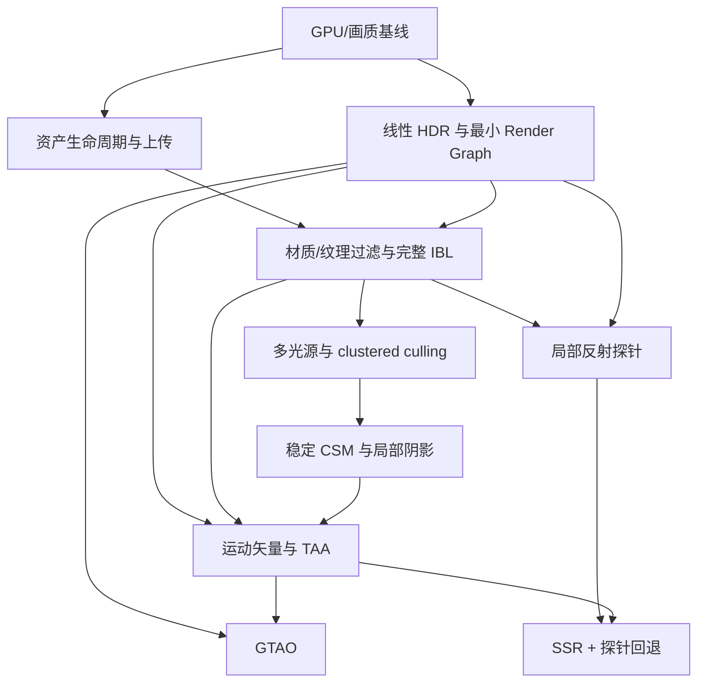

# 现代渲染器路线

日期：2026-10-03。状态：Q1–Q16 已确认，路线正式生效。M1 与 M2-A 线性 HDR 软件回归已交付，当前入口为 M2-B 最小 Render Graph；M0 硬件验收按用户要求延后。下列渲染功能按阶段推进。

目标是可靠加载静态 glTF/GLB 室内外场景、在移动中保持画质稳定的 Linux Vulkan 场景渲染器。保留已验证模块，重做资源与绘制接口；每 1–2 周验收一个可运行增量。较大阶段拆成多个增量，不承诺每个完整算法都在两周内完成。

详细现状与问题证据见 [项目设计审查](./Renderer_Design_Review.md)。

## 已确认的产品约束

| 决策 | 验收范围 |
|---|---|
| 平台与帧预算 | Linux 本机，RTX 4060 Ti，固定原生 1920×1080、60 FPS；允许效果质量档，第一轮不依赖动态分辨率或 DLSS/FSR。 |
| 内容 | 静态 glTF/GLB 室内外场景；相机、物体和灯光可移动。OBJ 提供兼容入口；骨骼动画后置。 |
| 材质 | 核心 metallic-roughness PBR 与现有资产必需扩展；明确报告未支持的语义。 |
| 画质 | 正确 PBR、HDR 合成、阴影、抗锯齿和材质表现；运动稳定性是硬要求，接受有限柔化，控制拖影。 |
| 灯光与阴影 | 一盏太阳光加数十盏局部灯；太阳光 CSM，少量重点局部灯动态阴影。初始以四盏聚光灯阴影为预算起点，测量后调整。 |
| 反射与间接光 | 完整环境 IBL，局部探针先行，SSR 后续并用探针补缺；实时动态漫反射 GI 与光追后置。 |
| 改动范围 | 重做关键模块接口、帧资源与上传职责，保留可复用部分。最小 Render Graph，单图形队列先行。 |
| 依赖 | 成熟库可承接内存分配、资产解析和离线优化；核心渲染、光照和 Render Graph 由项目实现。 |

Q16 一并确认的实现细则：探针第一版静态/按需刷新；OBJ 默认保留作者坐标；第一轮透明度保证 alpha mask/blend，不自动扩展到体积玻璃、透射或折射。

## 保留、重做与暂缓

保留 Vulkan 1.3、动态渲染、窗口/UI、现有直接 BRDF、SH 漫反射、基础 PCF、导入语义修复及其回归测试。保留当前最小 SceneEcs；只补移动场景物体需要的身份与变换信息。

重做 GPU 资产所有权、批量上传、Renderer 对外接口、帧级资源与历史管理、主场景 HDR 输出和 pass 编排。每次迁移都保持可运行，不同时替换所有 Vulkan 封装。

暂缓通用编辑器、多图形 API RHI、骨骼动画、Nanite 类系统、mesh shader、全面 bindless、GPU-driven、多队列/异步计算、实时 GI、RT 反射和 DLSS/FSR。后续依据能力需求和测量重新打开；“现代”本身不构成加入技术的理由。

## 主架构与接口契约

`Application` 负责窗口、交互、加载请求和场景更新；输出当前场景快照与渲染设置。`Renderer` 内部决定通道与资源依赖，不让 Application 知道每个阴影、AO、反射和后处理 pass 的调用顺序。

建议的外部接口范围如下，名称和具体 C++ 类型在实施时调整：

```text
prepareScene(cpuAssets) -> 候选 GPU 资产与上传完成状态 / 错误
commitScene(readyCandidate) -> 新场景引用；旧资产延迟退休
render(sceneSnapshot, camera, settings, ui) -> 帧结果 / 测量
resize(extent, outputFormat) -> 仅更新受影响资源
```

候选未完成不提交；失败保持旧场景与 UI 状态。旧资产直到所有使用它的提交完成后才释放。Renderer、环境、流水线缓存和帧资源独立于场景资产。GPU 不再引用旧资产后，CPU 资产与 UI 预览描述符也按各自生命周期回收。

Image 数据、用途对应的 View/Texture、Sampler、Material 分开标识。缓存键包含数据身份、颜色空间/格式和 mip 策略；sampler 不应导致同一图像重新上传。glTF 解析库通过一个适配层生成项目资产描述，库类型不扩散到 UI 或 Renderer。

最小 Render Graph 只负责 pass 依赖、资源读写与状态转换、清除/保留、导入外部资源和分辨率依赖。采用固定、可检查的资源描述和单队列执行；跨帧历史由 Renderer 显式管理，不用第一版图编译器隐藏。两个在飞行的帧是待测配置，需要正确隔离 frame-context、资源复用与历史依赖。

## 图像数据与通道关系

优先建立浮点 scene-linear HDR 颜色、可采样并保留的深度、按效果需要提供的法线/粗糙度，以及 TAA 使用的运动矢量与历史结果。候选格式先检查设备支持与带宽，HDR 从 RGBA16F 评估；不因采用 forward 就排斥这些辅助缓冲。

统一坐标系、矩阵、法线变换、UV、深度重建和 jitter 约定。第一轮沿用已验证深度约定；Reverse-Z 作为独立精度改进候选，在主深度、阴影、重建和剔除测试都齐全后评估。



最终通道分工：阴影与 light culling → 主不透明颜色/深度/辅助结果 → AO 与局部反射解析 → HDR 透明合成 → TAA → 曝光/Bloom/显示变换 → UI → Present。AO 必须在需要的间接光合成前可用；SSR 输入不包含自身递归反射。为这些依赖拆出必要的间接光/反射合成结果；如果采用预通道，也要将其成本计入总帧时。第一版图按已接入效果逐步增长。

## 阶段与验收

### M0：可信测量与画质基线

交付：设备能力/实际显存记录、GPU timestamp、debug names/labels、pass 与上传统计、固定相机路径、标准材质场景和截图/录像基线。测量基础已交付；用户明确说明系统运行在移动硬盘上，硬件验收等其通知换回 RTX 4060 Ti 后再执行，期间按后续阶段继续开发。

验收：四合院、Sponza_2 和微型语义场景可重复运行；普通运行与 RenderDoc 的画质证据关联；CPU/GPU 时间分开；明确 validation layer 是否可用；记录初次加载、重复加载、失败、连续切换与 resize 的基线。硬件不可见时只接受功能证据，不填写硬件性能结论。

### M1：资产提交、共享资源和批量上传

增量 A：持久 Renderer 与候选资产集合分离，保留失败恢复。增量 B：独立图像/sampler 缓存、批量 staging、后台准备/就绪轮询、按完成帧回收旧资产和预览。增量 C：比较成熟解析器与内存分配库，在适配层迁移并补语义测试。

验收：切换场景不重建环境与无关流水线；同语义共享图像只上传一次；每张纹理不再单独 queue.waitIdle；加载失败仍可操作旧场景；连续加载资源数量和峰值显存可解释。库选择比较维护状态、许可证、Linux/Vulkan 支持、包体和既有 fixture 兼容，选定前不把某个库写死。

### M2：HDR 输出与最小 Render Graph

增量 A（已交付软件实现）：主场景/天空/透明写入统一 RGBA16F HDR，移除材质/天空末端 tone mapping，加入独立显示输出与全场景 EV 曝光、环境强度分离及 output 时间区间。四格式离屏回读、实际透明合成/天空、失败回收/resize、10 项 CTest 与四合院 1080p 烟测通过。见 [实施合同](docs/M2_A_HDR_Implementation.md)。增量 B（下一项）：迁移现有阴影、主场景、输出和 UI 到最小图。增量 C：完善资源退休和 frame context，测量一帧/两帧方案。

验收：超过 1 的高光与 emissive 在 HDR 中可见；透明混合在色调映射前完成；sRGB 编码恰好一次；UI 不随曝光改变；resize、最小化、恢复和场景切换没有陈旧资源或历史。提供 resource/pass 可视化。单队列正确同步先行，不要求别名或异步队列。

### M3：材质和完整 IBL

增量 A：glTF sampler、typed mip、各向异性能力处理、alpha coverage 与原始 tangent/法线空间验收。增量 B：GGX cubemap 预过滤、BRDF LUT 与环境烘焙缓存，保留 SH。增量 C：`KHR_materials_specular` 等必要扩展、材质球对照与镜面抗锯齿。

验收：金属/电介质、粗糙度 0→1、HDR 高频灯、不同 UV 集、多种 sampler 和双面/负缩放场景；相同输入下直接光与 IBL 的材质参数一致。局部灯、emissive 与环境都经过同一相机曝光；固定曝光比较参考结果，避免自动曝光掩盖能量错误。

算法参考为 [Filament 材质与 IBL](https://google.github.io/filament/main/filament.html)。参考其公式与验证方法，不把其整体引擎接口照搬到本项目。

### M4：多光源与 Clustered Forward

先建立正确的多点光/聚光灯普通 forward，对照 GPU light culling 方案。目标覆盖一盏太阳光与数十盏局部灯；cluster 用屏幕分块加深度切片管理候选灯，不在每个 fragment 遍历所有灯。

验收：1/16/32/64 灯测试，含相机/灯光移动、细小光源、大范围重叠和透明物体；剔除结果与朴素全灯结果一致，溢出显式诊断并使用正确性回退。剔除成本高于收益时让低灯数路径自动或手动走简单 forward。保留 tiled Forward+ 的比较入口；deferred 仅在新的需求或测量推翻此选择时重新设计。

### M5：稳定阴影

太阳光使用 CSM，补齐级联分配、稳定投影/texel snapping、边界混合和偏移约定；保留 PCF。局部阴影先做受预算管理的聚光灯 atlas，初始最多四盏重点灯；为每盏灯做投影范围与投影者剔除。

验收：固定场景慢速平移/旋转、远处屋瓦、级联交界、太阳角度变化、薄墙/双面叶片和移动物体。不能靠过大 bias 掩盖 acne；接触不得明显脱离。点光立方体阴影、PCSS、虚拟阴影图后置。级联原理参考 [CSM 技术说明](https://learn.microsoft.com/en-us/windows/win32/dxtecharts/cascaded-shadow-maps)。

### M6：运动矢量与 TAA

增量 A：保留上一帧相机/物体矩阵，建立 jitter 与速度缓冲的统一约定。增量 B：history reprojection、遮挡显露拒绝、邻域限制和运动自适应权重。增量 C：透明/alpha mask 响应、曝光变化、灯光变化与镜面细节调优。

验收：慢/快相机、静止相机移动物体、移动灯、远处瓦片/植被、高光、遮挡显露、场景切换、相机跳变和 resize。静止累计不得长期模糊；错误历史必须拒绝；切换和跳变清空历史；拖影用固定路径逐帧检查。FXAA/SMAA 可作为关闭 TAA 时的比较路径，不能据此宣布运动稳定性目标完成。

机制与失败模式参考 [Temporal Antialiasing Survey](https://research.nvidia.com/labs/rtr/publication/yang2020survey/)。不能把 TAA 的固定混合系数当作解决所有拖影的方案。

### M7：GTAO 与有限后处理

采用 GTAO 类屏幕空间遮蔽，先空间滤波再按需要加入时间复用；用正确的深度/法线重建。AO 调制适当的间接光项，避免将直射光与 emissive 一起变黑。加入可控 Bloom；手动曝光保持回归基线，自动曝光随后作为可关闭增量。

验收：接触区域、薄物体、屏幕边缘、尺度变化、遮挡显露和相机运动；关闭 AO 对比，明确 off-screen 信息缺失。参考 [GTAO 原始策略](https://www.activision.com/cdn/research/Practical_Real_Time_Strategies_for_Accurate_Indirect_Occlusion_NEW%20VERSION_COLOR.pdf)；[XeGTAO](https://github.com/GameTechDev/XeGTAO) 可供实现对照，但仓库已归档，不列为必须维护的 Vulkan 依赖。

### M8：局部反射探针，再 SSR

增量 A：局部 cubemap 捕获/导入、与全局环境一致的 GGX 预过滤、箱体视差校正、覆盖范围与混合权重。初版静态或用户按需更新；不承诺每帧更新所有探针。移动灯/物体可以使探针变旧，UI 必须暴露更新状态与手动刷新。

增量 B：SSR 使用 HDR 颜色、深度层级、法线/粗糙度和运动历史，输出命中结果与置信度。有效屏幕命中与探针 fallback 组合为同一个镜面反射来源，避免与现有 IBL 双重累加。参考 [SSSR 官方流程](https://gpuopen.com/manuals/fidelityfx_sdk/techniques/stochastic-screen-space-reflections/) 的输入和回退机制，不承诺 SDK 能直接替换 Linux GLSL 实现。

验收：室内墙面与附近灯光反射、屏幕边缘退出、屏幕外目标、镜面到粗糙面、探针覆盖交界、物体移动与遮挡显露。明确 SSR 只能使用屏幕可见信息，探针视差校正也仅为局部近似。若内容要求屏幕外动态物体的准确反射，需要重新开 RT/探针更新预算决策。

## 优化顺序与触发条件

| 层次 | 技术 | 进入条件与验收 |
|---|---|---|
| 前期直接改进 | 共享纹理、批量上传、脏标记、状态排序、按依赖 resize、流水线缓存 | 对比加载/重复加载、CPU 帧时、资源数量和峰值显存；不假设每项都改善稳态 GPU 时间。 |
| 帧并行 | 两帧在飞行、资源退休 | lifetimes 与跨帧 hazard 已正确；比较 p95、显存和延迟后确定默认值。 |
| 降低采样与带宽 | KTX2/BCn、网格重排/压缩、可控 LOD | 显存、带宽或远景几何成本被测量确认；检查法线、alpha、粗糙度与轮廓损失。 |
| 可见性与提交 | 深度预通道、Hi-Z、GPU culling/indirect、bindless | 当前 overdraw、CPU 提交或大量物体是限制因素；对照关闭路径，遮挡错误零容忍。 |
| 大型后续能力 | 动态 GI、RT、多队列、虚拟几何/阴影、重建式上采样 | 完整主线通过、硬件能力与剩余预算可证实，且新增内容需要它。独立立项，不占用基础正确性预算。 |

VMA、glTF 解析器、meshoptimizer/KTX2 等只作为基础设施评估候选；选型检查为对应实施任务，不在本轮增加无用抽象或提前锁定版本。

## 性能预算和验收协议

目标是正常运行的 60 FPS，16.7 ms/帧。初始规划以 GPU p95 ≤14 ms 留余量，CPU 渲染准备 p95 ≤6 ms；这两个数是待硬件验证的预算，并不应相加为总帧时。呈现等待、输入延迟、长尾和 CPU/GPU 重叠单独记录。

GPU 14 ms 的初始分配：

| 分项 | 预算起点 |
|---|---:|
| 太阳光与局部阴影 | 2.5 ms |
| light culling、主场景、辅助缓冲、环境与透明 | 5.0 ms |
| GTAO、局部反射解析与 SSR | 3.0 ms |
| TAA、曝光、Bloom 与显示变换 | 2.0 ms |
| UI、图管理与其它 GPU 工作余量 | 1.5 ms |

这些分配是约束设计的起点，不是现有算法的实测或帧率保证。实测总量失败时先用质量档调整阴影分辨率、SSR 采样/分辨率、AO 和 Bloom 成本，保留正确材质与原生主渲染分辨率；仍失败则回到瓶颈证据调整实现。不得用 llvmpipe、RenderDoc 抓帧或第三方论文的耗时替代本机性能数据。

实际协议：Release 构建，原生 1080p，固定配置/相机轨迹；预热 30 秒，至少三次 120 秒稳态记录 p50/p95/p99。分别运行无遮帧限制的吞吐测量与正常 VSync 呈现测量，记录 GPU/CPU/present 数据；稳态吞吐至少 60 FPS、生产帧时 p95 ≤16.7 ms，VSync 下单独记录漏掉的刷新周期。加载、shader 初次构建和 GPU 场景提交单独统计。显存容量确认后再设预算，普通场景保留约 20% 余量；候选场景与旧场景共存峰值另外验收。

## 每个增量的质量闸门

1. 当前基线构建、相关 CPU 语义测试继续通过；新增测试针对可观察语义，不为简单封装补实现镜像测试。
2. 涉及 GPU 资源/同步的改动在 validation layer 可用环境检查；不可用必须记录缺口。Resize、最小化恢复、加载失败及连续切换无崩溃/陈旧描述符。
3. 固定曝光、输入资产、相机和质量设置，保存 pass 输出、标准截图以及运动片段；颜色编码和噪声影响需解释，不以随意截图判定正确。
4. 新算法带独立开关与 debug view，能分离深度、法线、velocity、history rejection、light list、cascade、AO、SSR confidence 和 probe 权重。
5. RenderDoc 用于帧资源/通道/像素证据；真实 RTX 4060 Ti 普通运行用于性能验收。相关方法见 [Vulkan profiling](https://docs.vulkan.org/guide/latest/profiling.html)。

RTR4 第 4–9 章作为变换、采样、阴影与 PBR 的稳定基础，第 11–12 章用于间接光和图像空间效果，第 18–20、23 章用于可见性、有效着色与 GPU 性能判断。2020 年 TAA survey 属于后续研究；引擎和 SDK 文档只提供算法与生产实现证据，不转移其平台/硬件性能保证。外部资料核对日期为 2026-10-02。

## 计划生效与第一项执行任务

新路线已替换 `Engine_Roadmap.md`；旧路线、Renderer 清单与相机计划的完整版本保存在 `docs/archive/`。新的 `Renderer_Refactor_Checklist.md` 作为阶段执行清单；相机计划入口指向历史记录。README 与项目进度快照已同步，历史决定注明被替代。原有代码改动保留。

2026-10-02 用户调整：目标硬件为 RTX 4060 Ti；移动硬盘系统暂不处理当前设备访问问题。M0 的 pass timing、固定相机路径与材质基准已落地，硬件性能/显存/画质验收保持待办，直到用户通知已换回 4060 Ti。该待办不再阻塞后续开发。

M1-A 已实现持久 Renderer 与候选场景资产集合：准备成功后提交，只替换网格/材质/描述符，旧帧完成后移除预览并释放旧资产。M1-B 的共享图像/sampler 与批量 staging 上传已实现：相同编码内容和颜色空间复用，sampler 独立缓存，单场景单提交/fence。后台准备、主线程单次上传与就绪轮询、取消后的上传保活和按完成帧退休预览已交付。精确资源/staging 账本也已交付：区分 payload、实际分配与独立 driver heap 采样，按生命周期分类并记录真实并存峰值，共享对象仅计一次。M1-C 已完成成熟库比较与 cgltf 导入迁移：补 sparse/normalized、交错属性、原始 tangent、独立 UV 变换、默认材质和扩展诊断；10 项回归与 sanitizer 检查通过。VMA buffer/staging 已迁移：项目映射接口、唯一 backing/suballocation 账本、上传与常驻生命周期隔离，以及取消/退休/归零回归。Texture/HDR 和 depth/shadow image 已迁移至公共 GpuAllocator：独立 view/sampler、混合 granularity、浮点回读、真实 resize 与最后 image/完整 shutdown 归零通过；10 项 CTest、报告与四合院烟测通过。M2-A 已实现线性 RGBA16F 场景/天空/透明合成与公共 EV/filmic/sRGB 输出：环境强度和曝光分离，数据 debug 绕过显示曲线，UI 后绘制；数值回读、10 项 CTest、24 帧报告和四合院烟测通过。当前下一项为 M2-B 最小单队列 Render Graph，随后 M2-C frame context。必要材质扩展的 shader 语义仍在 M3。
