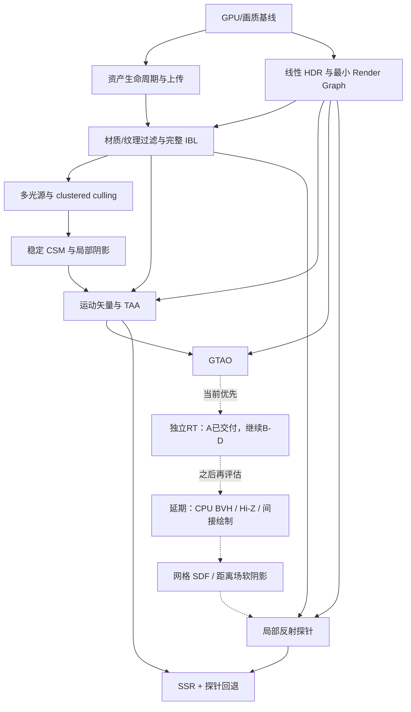

# 现代渲染器路线

日期：2026-10-09。状态：Q1–Q16 已确认，路线正式生效。M1、M2-A 线性 HDR 与 M2-B 最小图的软件回归已交付，M2-C1 帧上下文与 M2-C2 扩展呈现生命周期的软件增量已交付，M3-A1 typed mip/过滤已接入，M3-A2 coverage/切线空间的软件增量已交付，M3-B GGX 预过滤/BRDF LUT/SH 校准和缓存已交付软件增量，M3-C1 必要 specular 扩展的软件增量已交付，M3-C2 法线方差/镜面抗锯齿的软件增量已交付，M4-A 普通 forward 多光源基线的软件增量已交付，M4-B GPU clustered 剔除的软件增量已交付，厨房正确性修复提前实施 M5-B/M8-A 最小切片，M5-A 已交付稳定 CSM 软件增量，M6-A 已交付运动矢量/jitter 软件增量，M6-B TAA resolve 与RTX32项回归已交付，M6-C历史网格/重建与透明资格改进已交付，继续固定轨迹与呈现审查；用户已切回4060 Ti，硬件验证已开始。下列渲染功能按阶段推进。

2026-10-09 新调整（用户显式grill-me）：实时光追前置；独立RT与光栅分别建管线，共享场景/材质/光学参数/灯光/相机/曝光。首轮阴影/反射/多反弹GI、基础实体玻璃；开口玻璃明确薄片回退，不补洞；焦散专项/嵌套介质/体积散射后置。成熟降噪库（首选NRD），玻璃透射另行处理；主画面优先降噪，允许静止累积，初版RT无硬FPS，正式1080p；厨房+解析场景。UI首轮仅切换渲染方式，分屏/分割线/成对截图工具后置。用户先判断画质，助手仅被明确要求时评价。硬件BLAS/TLAS随RT建设；CPU对象BVH/Hi-Z/indirect/LOD和SDF延期。用户“推进光追管线”已确认完整方案及RT Pipeline＋SBT，见[实施清单](docs/RT_Comparison_Plan.md)；RT-A/B/C/D依次为基础+切换、光传输、玻璃、降噪与验收。RT-A独立主光线/BLAS-TLAS/SBT/HDR与UI切换已交付验证，见[记录](docs/RT_A_Implementation.md)；下一步RT-D。

目标是可靠加载静态 glTF/GLB 室内外场景、在移动中保持画质稳定的 Linux Vulkan 场景渲染器。保留已验证模块，重做资源与绘制接口；每 1–2 周验收一个可运行增量。较大阶段拆成多个增量，不承诺每个完整算法都在两周内完成。

详细现状与问题证据见 [项目设计审查](./Renderer_Design_Review.md)。

2026-10-08：厨房可见性/性能增量已交付，默认相机与阴影剔除，含无接收面级联筛选。
三个视角 HDR/探针重捕获保持一致，34/34 原生回归通过；先前 legacy/EXT 超时在可见窗口下通过。
同条件短测阴影约 -29.5%、整帧 GPU 中位数约 -9.1%；继续固定运动质量与长时间性能验收。
见 [实施记录](docs/Visibility_Performance_Implementation.md)。

2026-10-08 用户调整：GTAO 之后加入 BVH/Hi-Z 可见性与网格 SDF/距离场效果。
顺序改为 M7 AO → M8 层次可见性/提交 → M9 SDF/软阴影 → M10 多探针/SSR。
当前是逐 AABB 的扁平查询，没有树；BVH 节点仍可使用 AABB。
原 M8-A 单房间探针编号作为历史记录保留，详见 [AO 后路线](docs/Post_AO_Renderer_Plan.md)。

2026-10-09：按用户要求完成厨房光卡可见性、内腔局部镜面probe和等价重复/零面积面修复，39/39原生通过；原资产保留。见[记录](docs/Kitchen_Repair_Implementation.md)。该有限局部probe提前解决特定内腔遮挡，不等于M10完整多probe混合/SSR/RT交付，M8-A仍为后续能力任务。

## 已确认的产品约束

| 决策 | 验收范围 |
|---|---|
| 平台与帧预算 | Linux 本机，RTX 4060 Ti；光栅保持原生1080p/60FPS目标，初版独立RT无硬FPS门槛；正式对照固定1080p，预览可调采样/分辨率；不依赖DLSS/FSR。 |
| 内容 | 静态 glTF/GLB 室内外场景；相机、物体和灯光可移动。OBJ 提供兼容入口；骨骼动画后置。 |
| 材质 | 核心 metallic-roughness PBR 与现有资产必需扩展；明确报告未支持的语义。 |
| 画质 | 正确 PBR、HDR 合成、阴影、抗锯齿和材质表现；运动稳定性是硬要求，接受有限柔化，控制拖影。 |
| 灯光与阴影 | 一盏太阳光加数十盏局部灯；太阳光 CSM，少量重点局部灯动态阴影。初始以四盏聚光灯阴影为预算起点，测量后调整。 |
| 反射与间接光 | 已交付IBL/局部探针；独立RT阴影/反射/多反弹GI前置；首轮含实体玻璃，光栅以屏幕/探针近似，光学参数共享。基础实体/薄片范围已明确；焦散专项、嵌套介质和体积散射后置。 |
| 改动范围 | 重做关键模块接口、帧资源与上传职责，保留可复用部分。最小 Render Graph，单图形队列先行。 |
| 依赖 | 成熟库可承接内存分配、资产解析和离线优化；核心渲染、光照和 Render Graph 由项目实现。 |

原Q16实现细则：探针第一版静态/按需刷新；OBJ默认保留作者坐标。2026-10-09透明范围已被新决定扩展：实体玻璃/IOR/透射/吸收列入RT首轮，两条路径共享光学参数，光栅为近似实现；闭合验证网格用实体，开口用薄片并提示；焦散专项、嵌套介质和体积散射后置。完整实施清单仍待最终确认。

## 保留、重做与暂缓

保留 Vulkan 1.3、动态渲染、窗口/UI、现有直接 BRDF、SH 漫反射、基础 PCF、导入语义修复及其回归测试。保留当前最小 SceneEcs；只补移动场景物体需要的身份与变换信息。

重做 GPU 资产所有权、批量上传、Renderer 对外接口、帧级资源与历史管理、主场景 HDR 输出和 pass 编排。每次迁移都保持可运行，不同时替换所有 Vulkan 封装。

当前实施顺序：已交付AO/厨房 → 独立RT对照 → 延期CPU对象BVH/Hi-Z/受控间接绘制/LOD → SDF；具体后续实现按测量选择。

暂缓通用编辑器、多图形 API RHI、骨骼动画、Nanite 类系统、mesh shader、全面 bindless、全面 GPU-driven、多队列/异步计算、通用动态GI扩展、DLSS/FSR。RT首轮多反弹GI不再列为暂缓。后续依据能力需求和测量重新打开；“现代”本身不构成加入技术的理由。

## 主架构与接口契约

`Application` 负责窗口、交互、加载请求和场景更新；输出当前场景快照与渲染设置。`Renderer` 内部决定通道与资源依赖，不让 Application 知道每个阴影、AO、反射和后处理 pass 的调用顺序。

建议的外部接口范围如下，名称和具体 C++ 类型在实施时调整：

```text
prepareScene(cpuAssets) -> 候选 GPU 资产与上传完成状态 / 错误
commitScene(readyCandidate) -> 新场景引用；旧资产延迟退休
render(sceneSnapshot, camera, settings, ui) -> 帧结果 / 测量
resize(extent, outputFormat) -> 仅更新受影响资源
```

候选未完成不提交；失败保持旧场景与 UI 状态。旧资产直到所有使用它的提交完成后才释放。Renderer、环境、流水线缓存和帧资源独立于场景资产。GPU 不再引用旧资产后，CPU 资产与 UI 预览描述符也按各自生命周期回收。

Image 数据、用途对应的 View/Texture、Sampler、Material 分开标识。缓存键包含数据身份、颜色空间/格式和 mip 策略；sampler 不应导致同一图像重新上传。glTF 解析库通过一个适配层生成项目资产描述，库类型不扩散到 UI 或 Renderer。

最小 Render Graph 只负责 pass 依赖、资源读写与状态转换、清除/保留、导入外部资源和分辨率依赖。采用固定、可检查的资源描述和单队列执行；跨帧历史由 Renderer 显式管理，不用第一版图编译器隐藏。两个在飞行的帧是待测配置，需要正确隔离 frame-context、资源复用与历史依赖。

## 图像数据与通道关系

优先建立浮点 scene-linear HDR 颜色、可采样并保留的深度、按效果需要提供的法线/粗糙度，以及 TAA 使用的运动矢量与历史结果。候选格式先检查设备支持与带宽，HDR 从 RGBA16F 评估；不因采用 forward 就排斥这些辅助缓冲。

统一坐标系、矩阵、法线变换、UV、深度重建和 jitter 约定。第一轮沿用已验证深度约定；Reverse-Z 作为独立精度改进候选，在主深度、阴影、重建和剔除测试都齐全后评估。



图中的虚线表示新增阶段的实施顺序，不表示 SDF 是探针/SSR 的技术前置依赖。

最终通道分工：阴影与 light culling → 主不透明颜色/深度/辅助结果 → AO 与局部反射解析 → HDR 透明合成 → TAA → 曝光/Bloom/显示变换 → UI → Present。AO 必须在需要的间接光合成前可用；SSR 输入不包含自身递归反射。为这些依赖拆出必要的间接光/反射合成结果；如果采用预通道，也要将其成本计入总帧时。第一版图按已接入效果逐步增长。

## 阶段与验收

### 当前前置阶段：RT-A/B/C/D

RT-A/B/C独立管线、光传输和基础玻璃已实施验证，下一步RT-D降噪。详细资源/同步/玻璃/降噪及验证边界见[RT实施清单](docs/RT_Comparison_Plan.md)。完整方案已确认；继续完成NRD/透射处理及整体验证；CPU对象BVH/Hi-Z/indirect/LOD及SDF在完整RT对照阶段后评估。

### M0：可信测量与画质基线

交付：设备能力/实际显存记录、GPU timestamp、debug names/labels、pass 与上传统计、固定相机路径、标准材质场景和截图/录像基线。测量基础已交付；用户明确说明系统运行在移动硬盘上，硬件验收等其通知换回 RTX 4060 Ti 后再执行，期间按后续阶段继续开发。

验收：四合院、Sponza_2 和微型语义场景可重复运行；普通运行与 RenderDoc 的画质证据关联；CPU/GPU 时间分开；明确 validation layer 是否可用；记录初次加载、重复加载、失败、连续切换与 resize 的基线。硬件不可见时只接受功能证据，不填写硬件性能结论。

2026-10-05 补充资产覆盖：采用 [Country Kitchen](assets/models/pbr_kitchen/README.md)
完整 core 场景观察室内遮挡、材质与后续阴影/反射，使用明确标注的剖面副本进行
默认相机下的材质检查；[Flight Helmet](assets/models/pbr_flight_helmet/README.md)
补充 normal/ORM 纹理、切线、颜色空间和镜面运动表现。四合院保留为资产兼容回归，
解析小场景保留为数值参考。已下载固定版本并记录许可/SHA-256，软件加载烟测通过；
资产近似边界和 validation layer 不可用均已记录，硬件验收安排不变。

### M1：资产提交、共享资源和批量上传

增量 A：持久 Renderer 与候选资产集合分离，保留失败恢复。增量 B：独立图像/sampler 缓存、批量 staging、后台准备/就绪轮询、按完成帧回收旧资产和预览。增量 C：比较成熟解析器与内存分配库，在适配层迁移并补语义测试。

验收：切换场景不重建环境与无关流水线；同语义共享图像只上传一次；每张纹理不再单独 queue.waitIdle；加载失败仍可操作旧场景；连续加载资源数量和峰值显存可解释。库选择比较维护状态、许可证、Linux/Vulkan 支持、包体和既有 fixture 兼容，选定前不把某个库写死。

### M2：HDR 输出与最小 Render Graph

增量 A（已交付软件实现）：主场景/天空/透明写入统一 RGBA16F HDR，移除材质/天空末端 tone mapping，加入独立显示输出与全场景 EV 曝光、环境强度分离及 output 时间区间。四格式离屏回读、实际透明合成/天空、失败回收/resize、10 项 CTest 与四合院 1080p 烟测通过。见 [实施合同](docs/M2_A_HDR_Implementation.md)。增量 B（已交付软件实现）：阴影、主场景、输出、独立 LOAD/STORE UI 迁移到最小单队列图；主深度保留并导出可读状态，Application 只提交 draw list，统一资源状态与依赖检查并提供实际 dump。11 项 CTest 通过；原生 iconify 未被当前窗口管理器确认，显式 restore/recreation 已验收。见 [图实施合同](docs/M2_B_Graph_Implementation.md)。增量 C1：启动时一帧/两帧配置、独立 mutable frame resources、成功提交 ID、逐帧完成交付和场景/UI 退休验证，见 [帧上下文合同](docs/M2_C_Frames_Implementation.md)。增量 C2（已交付扩展路径）：KHR/EXT maintenance 能力协商、SwapChain 持有每图像 semaphore/fence、入队错误记账、重建/退出 drain 与显式 legacy 退路。软件呈现环境 17 项测试通过；本隔离会话原生 MIT-SHM/DRI3 fence 导入的顺序故障保留，见 [呈现合同](docs/M2_C2_Presentation_Implementation.md)。legacy 的普通 WaitIdle 仍不提供完整释放证明，报告明确标为 false。真实吞吐/延迟比较、原生驱动与 4060 Ti 验收等用户换机通知。

验收：超过 1 的高光与 emissive 在 HDR 中可见；透明混合在色调映射前完成；sRGB 编码恰好一次；UI 不随曝光改变；resize、最小化、恢复和场景切换没有陈旧资源或历史。提供 resource/pass 可视化。单队列正确同步先行，不要求别名或异步队列。

### M3：材质和完整 IBL

增量 A1 已实现：glTF sampler、CPU typed mip、全链上传/view 与各向异性能力处理。A2 已完成单来源 alpha coverage、编辑/复合/vertex/POM 回退、顶点 alpha、Mikk seam 和法线/负缩放合同，19/19 CPU/软件 Vulkan 回归通过。见 [A2 实施](docs/M3_A2_Material_Implementation.md)。增量 B 已完成：GGX cubemap 预过滤、BRDF LUT、准确 SH 投影与环境烘焙缓存，20/20 CPU/软件 Vulkan 回归通过，见 [IBL 实施](docs/M3_B_IBL_Implementation.md)。增量 C1 已完成：四合院 `KHR_materials_specular` 的因子、线性 A/sRGB RGB 贴图、独立 UV/sampler、直接光/IBL、UI debug 和参考材质；20/20 软件回归、sanitizer/SPIR-V、四合院一/两帧报告通过，见 [specular 实施](docs/M3_C1_Specular_Implementation.md)。增量 C2 已完成：一阶矩/法线 alpha 长度损失、几何导数过滤、直接光/IBL 共用粗糙度、AA 开关与参考场景；20/20 软件回归、sanitizer/SPIR-V 和四合院 GPU 账本零增量，见 [镜面 AA 实施](docs/M3_C2_Specular_AA_Implementation.md)。运动画质/成本等 4060 Ti 验收。

验收：金属/电介质、粗糙度 0→1、HDR 高频灯、不同 UV 集、多种 sampler 和双面/负缩放场景；相同输入下直接光与 IBL 的材质参数一致。局部灯、emissive 与环境都经过同一相机曝光；固定曝光比较参考结果，避免自动曝光掩盖能量错误。

算法参考为 [Filament 材质与 IBL](https://google.github.io/filament/main/filament.html)。参考其公式与验证方法，不把其整体引擎接口照搬到本项目。

### M4：多光源与 Clustered Forward

先建立正确的多点光/聚光灯普通 forward，对照 GPU light culling 方案。目标覆盖一盏太阳光与数十盏局部灯；cluster 用屏幕分块加深度切片管理候选灯，不在每个 fragment 遍历所有灯。

M4-A 已交付普通 forward 基线：glTF/GLB KHR_lights_punctual、UI 世界空间编辑、每帧独立 SSBO、64→65扩容、与C1/C2共用BRDF。21/21软件回归、独立HDR数值、pending双槽及资产原子发布/归零通过，见 [实施](docs/M4_A_Punctual_Implementation.md)。M4-B 已交付同队列 GPU clustered：64×64/24视深度分区、透明覆盖、每槽config/indices、图buffer屏障和独立culling查询；22/22软件回归、84组HDR全图对照及双pending槽通过，见 [实施](docs/M4_B_Clustered_Implementation.md)。手动full及溢出保持全灯路径，低灯数自动阈值等硬件测量。厨房修复切片已接最多四盏聚光灯图集阴影；点光/局部方向光阴影仍未接入。

验收：1/16/32/64 灯测试，含相机/灯光移动、细小光源、大范围重叠和透明物体；剔除结果与朴素全灯结果一致，溢出显式诊断并使用正确性回退。剔除成本高于收益时让低灯数路径自动或手动走简单 forward。保留 tiled Forward+ 的比较入口；deferred 仅在新的需求或测量推翻此选择时重新设计。

### M5：稳定阴影

用户于2026-10-05确认先修复厨房：提前实施最多四盏聚光灯图集阴影和
当时 M8-A 单房间按需探针（后续反射扩展现为 M10），见[决定](docs/Indoor_Lighting_Decision.md)。
M5-A 稳定CSM已交付软件实现：1/2/4级、固定世界光基/球形拟合/texel snapping、
重叠混合/远端渐退、世界单位偏移及PCF接收面校正。28/28 CPU/软件GPU回归、
三次实际viewer启动通过，见[实施](docs/M5_A_CSM_Implementation.md)。
投影者先完整绘制，剔除/分辨率档基于测量继续；4060Ti轨迹/接触/薄叶/成本验收待补。

太阳光使用 CSM，补齐级联分配、稳定投影/texel snapping、边界混合和偏移约定；保留 PCF。局部阴影先做受预算管理的聚光灯 atlas，初始最多四盏重点灯；为每盏灯做投影范围与投影者剔除。

验收：固定场景慢速平移/旋转、远处屋瓦、级联交界、太阳角度变化、薄墙/双面叶片和移动物体。不能靠过大 bias 掩盖 acne；接触不得明显脱离。点光立方体阴影、PCSS、虚拟阴影图后置。级联原理参考 [CSM 技术说明](https://learn.microsoft.com/en-us/windows/win32/dxtecharts/cascaded-shadow-maps)。

### M6：运动矢量与 TAA

增量 A 已交付：成功提交才发布前帧相机/实例矩阵、每槽motion SSBO、主场景MRT速度/有效度、jitter与未抖动CSM约定、天空和透明边界以及显式重置；默认jitter关闭。[实施记录](docs/M6_A_Motion_Implementation.md)。增量B已实现：前帧线性clip.w、R32F历史深度、HDR历史重投影、遮挡显露/透明拒绝、YCoCg邻域限制和运动权重；默认TAA，CLI可关闭。[实施记录](docs/M6_B_TAA_Implementation.md)。M6-B RTX32项通过；M6-C已改善固定历史网格、CR/深度足迹/透明资格和材质响应。[记录](docs/M6_C_TAA_Implementation.md)。M6-C全量30/32，legacy/EXT呈现复测超时保持开放；继续固定轨迹审查。增量 C：透明/alpha mask 响应、曝光变化、灯光变化与镜面细节调优。

验收：慢/快相机、静止相机移动物体、移动灯、远处瓦片/植被、高光、遮挡显露、场景切换、相机跳变和 resize。静止累计不得长期模糊；错误历史必须拒绝；切换和跳变清空历史；拖影用固定路径逐帧检查。FXAA/SMAA 可作为关闭 TAA 时的比较路径，不能据此宣布运动稳定性目标完成。

机制与失败模式参考 [Temporal Antialiasing Survey](https://research.nvidia.com/labs/rtr/publication/yang2020survey/)。不能把 TAA 的固定混合系数当作解决所有拖影的方案。

### M7：GTAO 与有限后处理

M7-A2已修正无遮挡斜面能量与1px前景染色，并补独立射线参考、边缘/尺度/固定运动gate，36/36原生通过。见[实施](docs/M7_A2_AO_Quality_Implementation.md)。AO基础功能/质量gate具备，可按用户顺序进入M8-A对象BVH；更广运动/后处理与正式性能接受继续独立待办。

M7-A基础通路已交付：原生GTAO、深度几何法线、空间滤波、间接漫反射独立MRT、TAA前HDR合成、UI/CLI/debug和GPU计时；36/36原生回归与厨房48帧固定轨迹导出通过。见[实施记录](docs/M7_A_GTAO_Implementation.md)。仍需更广薄物体/屏幕边缘/尺度/运动参考质量与长时间预算接受；Bloom/自动曝光为后续增量。

采用 GTAO 类屏幕空间遮蔽，先空间滤波再按需要加入时间复用；用正确的深度/法线重建。AO 调制适当的间接光项，避免将直射光与 emissive 一起变黑。加入可控 Bloom；手动曝光保持回归基线，自动曝光随后作为可关闭增量。

验收：接触区域、薄物体、屏幕边缘、尺度变化、遮挡显露和相机运动；关闭 AO 对比，明确 off-screen 信息缺失。参考 [GTAO 原始策略](https://www.activision.com/cdn/research/Practical_Real_Time_Strategies_for_Accurate_Indirect_Occlusion_NEW%20VERSION_COLOR.pdf)；[XeGTAO](https://github.com/GameTechDev/XeGTAO) 可供实现对照，但仓库已归档，不列为必须维护的 Vulkan 依赖。

### M8：BVH 与遮挡/提交（延期，RT对照之后）

增量 A：对象 BVH 的构建/refit/重建、相机/光源层次查询，稳定 ID、完整历史和小场景扁平回退。
增量 B：Hi-Z 遮挡与实际减少绘制的提交路径；必要的实例表/间接命令/批次组织纳入同一增量，
不逐物体同步读回。增量 C：按几何/提交瓶颈验证 LOD/网格优化。

验收：300/1k/10k/50k实例的正确性、构建/更新/遍历/内存/整帧成本；
遮挡显露、快速相机、mask/blend、历史无效回退与图依赖正确，漏剔除零容忍。
BVH组织层次，Hi-Z处理视锥内遮挡；节点采用AABB不等于过时。见[具体合同](docs/Post_AO_Renderer_Plan.md)。

### M9：网格 SDF 与距离场效果（延期）

增量 A：离线/后台生成与缓存、网格距离/符号、3D资源上传、预算与可视化。
增量 B：一盏主要光源的距离场软阴影，近处细节与已有阴影按可靠度组合。
开放网格/薄墙、实例尺度与步进保守性明确诊断，缺失场回退到已支持的几何路径。
全局clipmap、远距离DFAO与GI作为进一步评估，SDF支持不代表动态GI完成。

验收：解析/三角形距离参考、符号/体素误差、镜像/缩放、薄物体/离屏遮挡；
字段驻留128MiB、效果额外GPU p95≤1ms作为初始目标，原总帧预算不提高。
详见[资源、预算和验收](docs/Post_AO_Renderer_Plan.md)。

### M10：局部反射探针，再 SSR

原 M8 顺延为 M10；已实现的单房间探针和当时 M8-A 记录不撤销。

增量 A：局部 cubemap 捕获/导入、与全局环境一致的 GGX 预过滤、箱体视差校正、覆盖范围与混合权重。初版静态或用户按需更新；不承诺每帧更新所有探针。移动灯/物体可以使探针变旧，UI 必须暴露更新状态与手动刷新。

增量 B：SSR 使用 HDR 颜色、深度层级、法线/粗糙度和运动历史，输出命中结果与置信度。有效屏幕命中与探针 fallback 组合为同一个镜面反射来源，避免与现有 IBL 双重累加。参考 [SSSR 官方流程](https://gpuopen.com/manuals/fidelityfx_sdk/techniques/stochastic-screen-space-reflections/) 的输入和回退机制，不承诺 SDK 能直接替换 Linux GLSL 实现。

验收：室内墙面与附近灯光反射、屏幕边缘退出、屏幕外目标、镜面到粗糙面、探针覆盖交界、物体移动与遮挡显露。明确 SSR 只能使用屏幕可见信息，探针视差校正也仅为局部近似。若内容要求屏幕外动态物体的准确反射，需要重新开 RT/探针更新预算决策。

## 优化顺序与触发条件

| 层次 | 技术 | 进入条件与验收 |
|---|---|---|
| 前期直接改进 | 共享纹理、批量上传、脏标记、状态排序、按依赖 resize、流水线缓存 | 对比加载/重复加载、CPU 帧时、资源数量和峰值显存；不假设每项都改善稳态 GPU 时间。 |
| 帧并行 | 两帧在飞行、资源退休 | lifetimes 与跨帧 hazard 已正确；比较 p95、显存和延迟后确定默认值。 |
| 降低采样与带宽 | KTX2/BCn、网格重排/压缩、可控 LOD | 显存、带宽或远景几何成本被测量确认；检查法线、alpha、粗糙度与轮廓损失。 |
| AO 后 M8 | BVH、Hi-Z、受控 GPU culling/indirect、LOD | 当前 overdraw、CPU 提交或大量物体是限制因素；对照关闭路径，遮挡错误零容忍。 |
| AO 后 M9 | 网格 SDF/距离场软阴影 | 先完成精度/缓存/驻留预算与可视化，再验证效果/整帧成本；开放或缺失字段明确回退。 |
| 大型后续能力 | 动态 GI、RT、多队列、虚拟几何/阴影、重建式上采样 | 完整主线通过、硬件能力与剩余预算可证实，且新增内容需要它。独立立项，不占用基础正确性预算。 |

VMA、glTF 解析器、meshoptimizer/KTX2 等只作为基础设施评估候选；选型检查为对应实施任务，不在本轮增加无用抽象或提前锁定版本。

## 性能预算和验收协议

目标是正常运行的 60 FPS，16.7 ms/帧。初始规划以 GPU p95 ≤14 ms 留余量，CPU 渲染准备 p95 ≤6 ms；这两个数是待硬件验证的预算，并不应相加为总帧时。呈现等待、输入延迟、长尾和 CPU/GPU 重叠单独记录。

GPU 14 ms 的初始分配：

| 分项 | 预算起点 |
|---|---:|
| 太阳光与局部阴影 | 2.5 ms |
| light culling、主场景、辅助缓冲、环境与透明 | 5.0 ms |
| GTAO、局部反射解析与 SSR | 3.0 ms |
| TAA、曝光、Bloom 与显示变换 | 2.0 ms |
| UI、图管理与其它 GPU 工作余量 | 1.5 ms |

这些分配是约束设计的起点，不是现有算法的实测或帧率保证。实测总量失败时先用质量档调整阴影分辨率、SSR 采样/分辨率、AO 和 Bloom 成本，保留正确材质与原生主渲染分辨率；仍失败则回到瓶颈证据调整实现。不得用 llvmpipe、RenderDoc 抓帧或第三方论文的耗时替代本机性能数据。

实际协议：Release 构建，原生 1080p，固定配置/相机轨迹；预热 30 秒，至少三次 120 秒稳态记录 p50/p95/p99。分别运行无遮帧限制的吞吐测量与正常 VSync 呈现测量，记录 GPU/CPU/present 数据；稳态吞吐至少 60 FPS、生产帧时 p95 ≤16.7 ms，VSync 下单独记录漏掉的刷新周期。加载、shader 初次构建和 GPU 场景提交单独统计。显存容量确认后再设预算，普通场景保留约 20% 余量；候选场景与旧场景共存峰值另外验收。

## 每个增量的质量闸门

1. 当前基线构建、相关 CPU 语义测试继续通过；新增测试针对可观察语义，不为简单封装补实现镜像测试。
2. 涉及 GPU 资源/同步的改动在 validation layer 可用环境检查；不可用必须记录缺口。Resize、最小化恢复、加载失败及连续切换无崩溃/陈旧描述符。
3. 固定曝光、输入资产、相机和质量设置，保存 pass 输出、标准截图以及运动片段；颜色编码和噪声影响需解释，不以随意截图判定正确。
4. 新算法带独立开关与 debug view，能分离深度、法线、velocity、history rejection、light list、cascade、AO、SSR confidence 和 probe 权重。
5. RenderDoc 用于帧资源/通道/像素证据；真实 RTX 4060 Ti 普通运行用于性能验收。相关方法见 [Vulkan profiling](https://docs.vulkan.org/guide/latest/profiling.html)。

RTR4 第 4–9 章作为变换、采样、阴影与 PBR 的稳定基础，第 11–12 章用于间接光和图像空间效果，第 18–20、23 章用于可见性、有效着色与 GPU 性能判断。2020 年 TAA survey 属于后续研究；引擎和 SDK 文档只提供算法与生产实现证据，不转移其平台/硬件性能保证。外部资料核对日期为 2026-10-02。

## 计划生效与第一项执行任务

新路线已替换 `Engine_Roadmap.md`；旧路线、Renderer 清单与相机计划的完整版本保存在 `docs/archive/`。新的 `Renderer_Refactor_Checklist.md` 作为阶段执行清单；相机计划入口指向历史记录。README 与项目进度快照已同步，历史决定注明被替代。原有代码改动保留。

2026-10-02 用户调整：目标硬件为 RTX 4060 Ti；移动硬盘系统暂不处理当前设备访问问题。M0 的 pass timing、固定相机路径与材质基准已落地，硬件性能/显存/画质验收保持待办，直到用户通知已换回 4060 Ti。该待办不再阻塞后续开发。

M1-A 已实现持久 Renderer 与候选场景资产集合：准备成功后提交，只替换网格/材质/描述符，旧帧完成后移除预览并释放旧资产。M1-B 的共享图像/sampler 与批量 staging 上传已实现：相同编码内容和颜色空间复用，sampler 独立缓存，单场景单提交/fence。后台准备、主线程单次上传与就绪轮询、取消后的上传保活和按完成帧退休预览已交付。精确资源/staging 账本也已交付：区分 payload、实际分配与独立 driver heap 采样，按生命周期分类并记录真实并存峰值，共享对象仅计一次。M1-C 已完成成熟库比较与 cgltf 导入迁移：补 sparse/normalized、交错属性、原始 tangent、独立 UV 变换、默认材质和扩展诊断；10 项回归与 sanitizer 检查通过。VMA buffer/staging 已迁移：项目映射接口、唯一 backing/suballocation 账本、上传与常驻生命周期隔离，以及取消/退休/归零回归。Texture/HDR 和 depth/shadow image 已迁移至公共 GpuAllocator：独立 view/sampler、混合 granularity、浮点回读、真实 resize 与最后 image/完整 shutdown 归零通过；10 项 CTest、报告与四合院烟测通过。M2-A 已实现线性 RGBA16F 场景/天空/透明合成与公共 EV/filmic/sRGB 输出：环境强度和曝光分离，数据 debug 绕过显示曲线，UI 后绘制；数值回读、10 项 CTest、24 帧报告和四合院烟测通过。M2-B 最小单队列 Render Graph 已接管通道、资源状态与 attachment 合同；可采样主深度、UI 保留、阴影初次初始化与开关、失败/resize/归零回归通过，共 11 项 CTest。原生 iconify/零尺寸等待与硬件验收仍待补，显式恢复和图目标重建可运行。M2-C1 一/两帧上下文与完成交付、M2-C2 KHR/EXT 呈现资源所有权与 drain 已接入，软件 WSI 环境 17 项通过；legacy 释放证明及当前原生 MIT-SHM/DRI3 顺序故障保留为开放边界。M3-A1 已接入 CPU typed mip、全链单批上传/view、六种 min 模式与受 feature/limit 限制的各向异性；M3-A2 已接入单来源 coverage mip、共享 LOD 0 编辑回退、vertex alpha、Mikk seam 与 normal/负缩放剔除，19/19 CPU/软件 Vulkan 回归通过。M3-B GGX prefilter/BRDF LUT/SH 校准与缓存、20/20 软件回归已交付。M3-C1 必要 specular 扩展 shader、参考材质、UI 与 20/20 软件回归已交付。M3-C2 法线方差/镜面抗锯齿与20/20软件回归已交付。M4-A 导入/编辑/每槽 SSBO/多光源 PBR 与21/21软件回归已交付。M4-B GPU clustered/config/indices/图buffer依赖与22/22软件回归、84组全图对照已交付。本轮提前实施厨房局部阴影/探针最小修复；M5-A 稳定CSM软件实现与28/28回归已交付；M6-A运动矢量/jitter软件增量和31项回归已交付；M6-B实现与RTX32项回归已交付；下一项M6-C，呈现等待/最终画质性能接受仍开放。

2026-10-09：RT-B光照/阴影可见性/反射/多反弹GI与均值已交付验证，45/45原生；物理玻璃和成熟降噪分别为RT-C/D。见[记录](docs/RT_B_Implementation.md)。

2026-10-09：RT-C基础光滑玻璃已实现：显式光学参数、闭合/薄片诊断、Fresnel/Snell/TIR/Beer和光栅探针近似。厨房6个光学网格为4实体/2薄片；下一项RT-D。见[记录](docs/RT_C_Implementation.md)。
