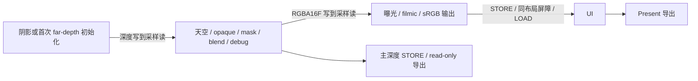

# M2-B：单队列 Render Graph 实施合同

2026-10-04。实现前使用 `real-time-rendering-advisor` 与深模块接口原则，核对官方 synchronization2 和动态渲染语义。选择与边界见 [实施决定](M2_B_Graph_Decision.md)。

## 帧与职责

无 UI 时输出直接导出 Present。关闭阴影的第一帧仍清一次 far-depth，保证绑定的阴影 descriptor 指向已初始化、可读的深度；之后关闭阴影不再录制该通道。首次初始化包含在真实 shadow 时间区间内。

Application 负责场景遍历、剔除、透明排序和 UI 数据，通过一次 `renderFrame(SceneDrawList, camera, lighting, shadows)` 提交借用的列表。Renderer 同步消费这些列表，组织阴影、主场景、显示和 UI 通道；完整 opaque/mask 列表包括相机视野外的投影者，可见列表决定主绘制。透明列表按调用者提供的顺序消费。材质/mesh ID、投影者 alpha 策略与模型矩阵有限性在获取 swapchain 图像前检查。

旧 `beginFrame/drawObject/endFrame` 入口只收集绘制，通过同一图执行；`beginMainPass` 已移除。`HdrOutput` 拥有附件与显示 pipeline，只在已打开的 rendering 内执行全屏绘制。HDR、主深度、阴影与每个 swapchain 图像的状态集中保存在 Renderer，图计划生成屏障和局部状态；提交成功后才发布下一帧状态。录制中不改已提交状态；UI 回调不能在活动帧期间替换。

资源仍由原 VMA/账本与 WSI 拥有。图没有分配、释放 GPU 资源或管理上传。resize 候选完整构建后交换，HDR/主深度/输出状态重置为 undefined，持久阴影状态保留；构建失败保留旧目标和状态。运行时资产提交、取消与预览退休仍使用既有上传和帧完成合同。

## 图编译与同步

`RenderGraph` 导入非拥有图像描述，声明 pass 的资源用途和 attachment load/store。编译按声明顺序推导 RAW/WAR/WAW，并按稳定拓扑顺序生成计划。额外依赖只排序独立通道的录制顺序；GPU 数据依赖必须通过图像用途声明，不隐藏在回调副作用中。循环、非法 ID、重复/反馈用途、缺少 usage、附件尺寸不一致和非 presentable 图像的 Present 均拒绝。

CLEAR 定义内容；LOAD 要求内容已定义。DONT_CARE + STORE 只有明确承诺完整覆盖时才定义内容；STORE DONT_CARE 使内容失效，后续读取/LOAD/export 拒绝。这比仅追踪 layout 更严格。声明顺序包含资源读写语义，不能用额外依赖把一次未初始化读取移到后声明写入之后；需要资源版本的通用图后续另行设计。

整图像单 mip/layer、单 graphics queue、单 color 与单 depth 附件。附件读写作用域保守覆盖 load/store，深度同时覆盖 Early/LateFragmentTests，颜色使用 ColorAttachmentOutput。即使 layout 不变，写后写及写后读仍产生屏障；连续同布局只读合并作用域。图负责 begin/endRendering、viewport/scissor、用途转换与最后导出。WSI acquire/present semaphore 和已有 queue-family sharing 策略仍在 Renderer/SwapChain。

主深度增加 Sampled/TransferSrc usage、能力检查和 STORE，并导出 DepthReadOnlyOptimal，为后续 AO/TAA 提供保留深度。本阶段没有 AO 或历史分配。UI 是独立 LOAD/STORE rendering；与显示输出之间有同布局 color write/read-write 屏障。该附件存取与每帧编译/dump 的成本尚未在 4060 Ti 测量，不宣称本轮提升性能。

Render Debug 面板的 Render Graph 折叠项显示实际资源名、格式/尺寸、初末状态、通道依赖、load/store/full coverage 和 stage/access/layout 屏障。GPU 的 shadow/main/output/UI 区间从通道入口屏障之后开始；入口/导出同步仍包含在 total 中。报告 schema 3 保持不变，仍为十个 timestamp query。

## 验证边界

CPU 测试不创建 Vulkan 实例，验证编译、内容、依赖与屏障合同；GPU 回归使用生产 graph backend 和 shaders 回读 HDR、显示、UI 标记和 D32 深度，保留原异步加载/取消/退休/resize/归零测试。软件驱动只能验证这些正确性条件。

当前窗口管理器不确认 GLFW iconify，请求最小化后恢复/重建与真实 ImGui 绘制可以检查，原生最小化确认和零尺寸等待路径仍需补验收。validation layer、RenderDoc 新抓帧、RTX 4060 Ti 帧预算、带宽和最终画质等待用户换机。typed mip、完整 GGX IBL、必需材质扩展仍在 M3。

下一增量 M2-C：先明确 frame-context 的 fence、uniform、command、query 和退休生命周期，再提供一帧/两帧配置与软件回归。硬件吞吐和延迟比较继续等待用户通知。

## 本轮结果

Release/Ninja 构建与 11/11 CTest 通过：9 CPU + 2 llvmpipe/X11 GPU。CPU 图检查覆盖 RAW/WAR/WAW、稳定排序/循环、depth scopes、same-layout UI、未定义 LOAD/read、丢弃后 export、完整覆盖和非法描述；编译不改外部状态。GPU 用 graph backend 绘制四种输出格式 × 五组 EV/tone 设置，FP16 palette ≤1 ULP、显示参考 ≤2 LSB。独立 UI 标记只覆盖一个像素，其他像素与显示参考一致。

实际 PBR emissive/alpha blend 仍回读 `(2.5,1.5,1.625,1)`，曝光不改 HDR；主深度为 `.5`，alpha=.5 的前景 z=.25 未写深度。首次关闭阴影的深度回读 1，初始化不会重复；false/true/false/true 期间主绘制为 2、投影者为 0/2/0/2，包含一个相机视野外物体。禁用的阴影 debug 不影响显示设置。非法 caster 在获取前拒绝；失败构建保持旧目标和状态，重建清理新目标状态并保留持久阴影。真实异步 ImGui 加载/失败/取消/退休/准备中退出及账本归零通过。

原事务回归仍为 4 commits / 6 frames / 5 upload submissions / 6 image copies / 0 runtime upload waits。三个实际 resize/render 回到初始 WM framebuffer（本次 1262×1372），HDR+depth payload 为 12 bytes/pixel，共享场景存储不变。原生最小化确认未通过，恢复后的图目标重建和 ImGui 运行通过，边界见上。

首轮 GPU 测试发现初次禁用阴影的空 draw 分支误触发 UI；修正为明确按 pass ID 分派。第二轮开关测试继承天空测试环境强度，纯 emissive 期望失效；固定测试光照后通过。失败日志与最终证据保存在聊天工作区 `outputs`。本轮未重复尝试已知受软件设备选择限制的 RenderDoc 捕获。

报告烟测 21 帧全部查询匹配；四合院 27 meshes/materials、原生 1920×1080/UI/orbit/FIFO 完成一个帧/query 和正常退出。资源与 M2-A 完全一致：payload 295,481,120 bytes，backing 当前/峰值 302,722,140 / 534,185,720 bytes，17 blocks / 137 ranges（84 buffers / 53 images）。源码 SHA256 `054e4fbff359cd75fe34ac88b06af552a840a8019621f7a74fc555cb0b51d7f9` 与构建和报告一致。软件时间不能代替硬件预算验收。
